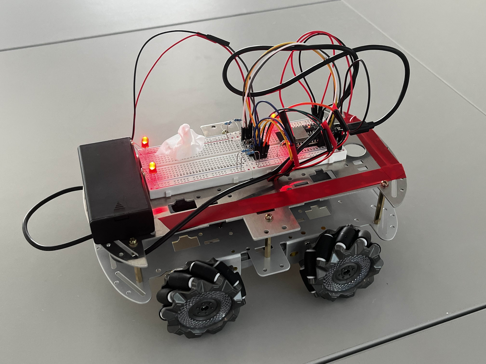
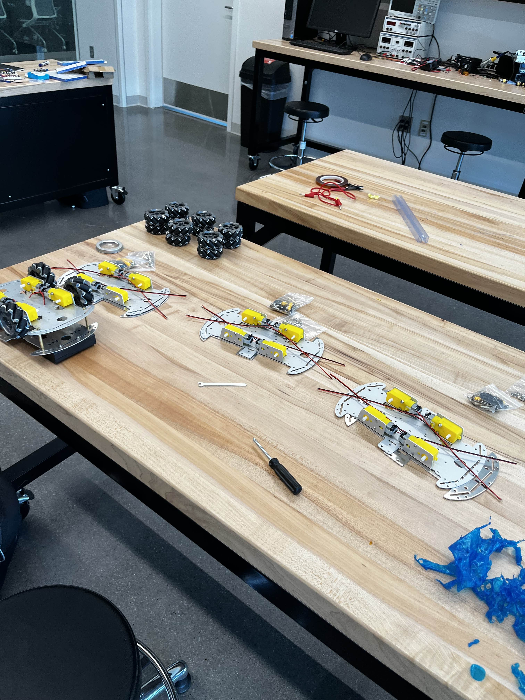

# CornCycle HW

[SOFTWARE REPO LINK](https://github.com/USS-Watson/corncycle-game)

1 of 3 CornBots pictured below:

# Technologies Used
ESP-NOW - Used to transmit from the base station ESP32 to the CornBots

BluePad 32 - Used to read controller input data and send to base station ESP32

# CornBot Details
Each Cornbot consists of an ESP32, 2 Li-on batteries, an IR LED, and 4 DC motors each connected to an integrated gearbox. All CornBots were assembled at Cornhacks 2025, ultimately tied together with a circuit made on a breadboard.

Each half of a CornBot is wired to an H-bridge motor controller, where it is controlled via PWM from the ESP32. The changing of duty cycles on the ESP32 PWM output allows us to turn, accelerate, and reverse each CornBot.

# Our Team
1. [Alex Schwarz](https://curtain.sh) || [curtainman](https://github.com/curtainman)
2. [Anton Angeletti](https://antonangeletti.com) || [anton-3](https://github.com/anton-3)
3. [Blaine Traudt](https://traudt.dev) || [blaine-t](https://github.com/blaine-t)
4. [Louis Quattrocchi](https://waltlab.com) || [WalterOfNone](https://github.com/WalterOfNone)
